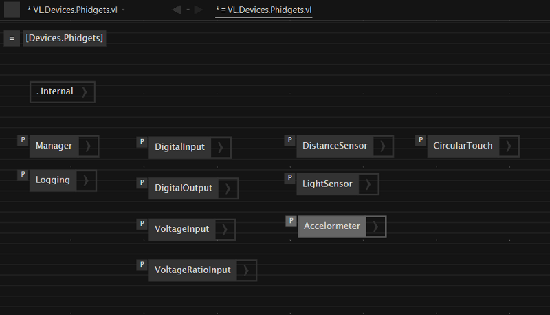
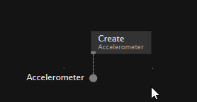
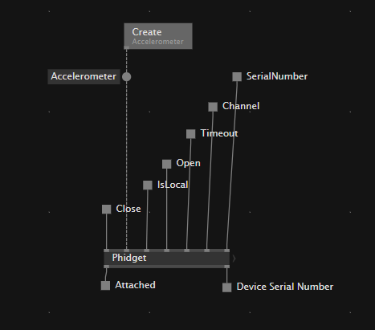
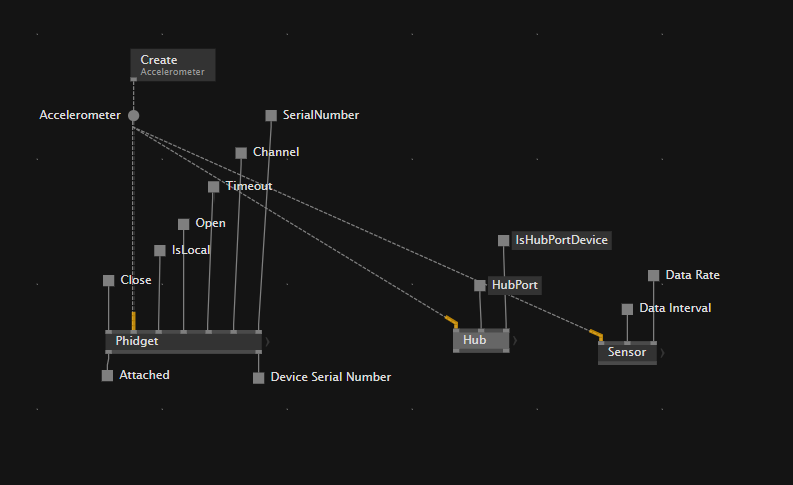
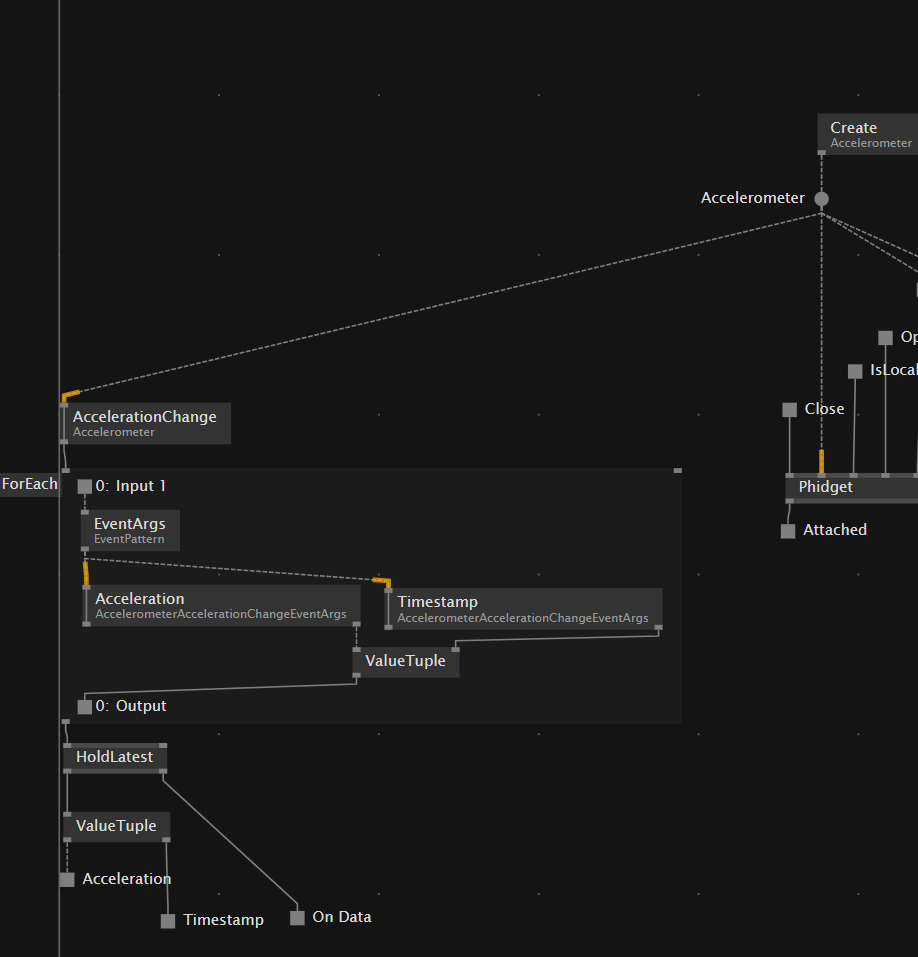
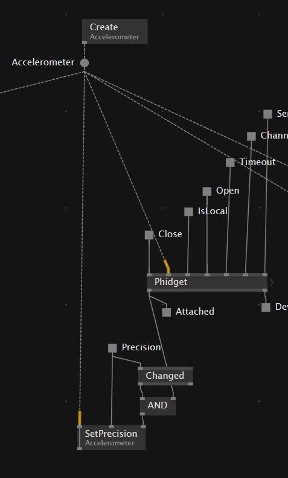

# VL.Devices.Phidgets
VL Integration for Phidgets
Try with the visual live-programming environment for .NET Download: http://visualprogramming.net 

## Installing 

To use the latest stable version:
1. Go to Gamma's Quad menu > Manage Nugets > Commandline and type:  
`nuget install VL.Devices.Phidgets -pre`
2. Press Enter and wait the ending of the installation process
3. Open the Help Menu (F1). Open the tap "Learn". Search for the pack "Devices.Phidgets"

## Contributing
Feel free to clone the repro an add missing Phidget Devices. Also you can make a pull request or send me the patch over any digital communication cannel. 

### How to add missing Phidgets Nodes
There are a huge List of Phidget Devices and Class. So it was no time to add alle devices to the package or to do it via factory pattern ([Phidget API](https://www.phidgets.com/?view=api))  
But the importend operation are bundles via processes so it is easy to add new nodes to the package. 
1. Clone the Repository and open the VL.Devices.Phidgets.vl Document
2. Open the Definition Patch (Shift+Alt+A)
3. Add a Process Node with the Name of the Phidget Class you want to add like "Accelerometer"  

  

4. Open the Process "Accelerometer" and Create the Accelerometer instance of the class

  

5. Assign the Node to the "Create" Operation via context menu

6. Store the Instance of the class in a pad with the name of the Class.  

8. Every class extends the phidget class to handle basic operation like open and close. To add these basic phidget operation to the accelerometer, we add the predefined phidget process and extend the Inputs and Outputs. 

9. If necessary you can add the operation for "Hub" or "Sensor" process with the predefined operation.  

10. Every Sensor comes with it own Event and EventArgs to send the Data from Device to Computer. This has to implemented by its own, but always follows the same structure. 

  

11. Also there are class related set operations for the devices. This can be add the operation to the patch and apply it if the phidget is attached and the pin is changed.

12. Create a help patch into the [help/Phidgets](./help/Phidgets) folder with the scheme "HowTo [ClassName]" and add your node and test and set the default pin settings so that everything works like expected.  

## Licencing
Licensed under the Apache License, Version 2.0 (the "License"). You may obtain a copy of the License at http://www.apache.org/licenses/LICENSE-2.0  
Unless required by applicable law or agreed to in writing, software distributed under the License is distributed on an "AS IS" BASIS, WITHOUT WARRANTIES OR CONDITIONS OF ANY KIND, either express or implied. See the License for the specific language governing permissions and limitations under the License. 

